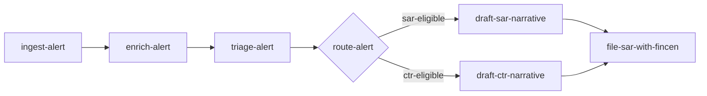

# IM-01 — Skill Architecture Patterns

> *Architect before automating: decompose the work into named, typed, individually testable skills before a single token is generated.*

## What this skill does

Coaches the engineer through decomposing a problem into a set of reusable, testable, composable AI skills. The output is a **Skill Graph** — a written list of skill candidates with owners and a Mermaid dependency diagram — that becomes the spine for every later framework in the Innorve Method. The skill teaches the architect to draw the boundaries before any prompt or model call is written, and to draw them by criteria rather than instinct.

## When to invoke it

- A working prototype exists as a single script, notebook, or prompt and the team wants to "productionize" it.
- A new system is being designed and there is no agreed unit of decomposition yet.
- Multiple engineers are about to add features in parallel and you want to prevent overlap.
- The user asks "what should be a skill versus what should be a tool?"
- The user has skills implicitly but cannot name them, and a downstream framework (IM-03 contracts, IM-06 capability graph) demands the names.

Do not invoke when the team already has named skills with documented owners. In that case, the question is downstream: contracts (IM-03), composition (IM-05), or mapping (IM-06).

## Where it sits in the Innorve Method

IM-01 is the foundation. Every later framework — contracts (IM-03), tenancy (IM-04), composition (IM-05), the capability graph (IM-06), the evidence binder (IM-07), and the maturity gate (IM-08) — assumes named, bounded skills. Skipping IM-01 forces every downstream artifact to be re-derived each time the implicit decomposition shifts; that is the single most common reason an AI system spends a quarter "almost ready to ship."

The skill is a direct application of the first tenet of Innorve Native Mode: architect before automating. A model summoned before the work has been decomposed will be asked to do everything at once, and there will be nothing inside the system to verify against.

## The coaching flow

Walk the user through these steps. Do not move on until each one has produced something written.

### 1. Establish the system's job

AskUserQuestion: *"In one sentence, what is the system supposed to do for the user or the business?"*

If the answer takes more than one sentence, push back. Two sentences usually means two systems. Force a single primary job. Secondary jobs go in a "deferred" list that becomes the input to a future Skill Graph.

### 2. Name the inputs and outputs at the system boundary

AskUserQuestion: *"What goes in (events, requests, files, signals) and what comes out (decisions, documents, side effects)?"*

Capture both as bullet lists. These are the I/O contract of the system, not of any one skill. IM-03 will derive per-skill contracts from this; the architect's job here is only to fix the outer boundary.

### 3. Walk the data through

Have the user describe, in order, what happens to a single representative input from arrival to final output. Make them be specific. "The alert is enriched" is not enough — enriched with what, by what, written where, with what side effects.

### 4. Cut the walk-through into skills

A skill candidate emerges wherever **one or more** of these is true:

- The step has a different owner or oncall.
- The step has a different failure mode the system should recover from independently.
- The step is reusable across more than one walk-through.
- The step calls a different external system.
- The step produces an artifact someone other than the next skill might read.

If none of those is true, it is not a skill. It is a function inside another skill.

AskUserQuestion: *"For each step, which of those five criteria applies? If none, fold it into its neighbor."*

### 5. Name each skill

Skills are named after what they produce, not what they do. Prefer `draft-sar-narrative` over `narrative-drafter`. Prefer `route-alert` over `alert-router`. The name is a contract preview — a teammate should be able to guess the output from the name alone. If the name is verb-only and ownerless, the contract will inherit the same ambiguity.

### 6. Sketch the dependency graph

Have the user draw the skills and their dependencies as a Mermaid diagram. Every edge is a real dependency: skill B cannot run until skill A produces its output. If two skills can run in parallel, do not draw a false edge. The visual asymmetry of a diagram is what surfaces missing parallelism and hidden routers.

### 7. Identify the seams

For every edge, ask: what is the artifact that crosses it? A SAR draft? A risk score? A redacted transcript? Write it on the edge. Edges without named artifacts are skills that were merged when they should have been split.

### 8. Pressure-test reusability

AskUserQuestion: *"For each skill, name a second system (real or hypothetical) where you would also use it. If you cannot, why is it a skill and not a function?"*

Some skills are intentionally single-use (the system's top-level orchestrator, for example). Most are not. If more than half the skills are single-use, the decomposition is too coarse — return to step 4.

## Inputs

The skill collects, in order:

1. The system's one-sentence job statement.
2. The system-level input list and output list.
3. A walk-through of one representative input.
4. The user's mapping of each step to the five skill criteria.
5. The user's proposed name and produced-artifact for each candidate skill.
6. The user's hand-drawn dependency graph (Mermaid source).
7. The user's named second-use case for each skill.

## Outputs

1. A **Skill Graph** artifact (see below).
2. A "deferred" list capturing secondary jobs deliberately excluded from this version of the system.
3. A list of seams (named artifacts on graph edges) that becomes the input to IM-03 (skill contracts).

## The artifact produced

A **Skill Graph** with two parts.

### Part A — the skill candidate list

For each skill, capture:

```yaml
- name: draft-sar-narrative
  produces: SAR Part III narrative (markdown, <= 4000 chars)
  consumes: enriched alert, customer KYC snapshot
  owner: financial-crimes-platform
  reuse: also used by CTR narrative drafting
  external: model call (no other side effects)
  criteria_satisfied: [different-failure-mode, reusable, model-call]
```

### Part B — the dependency diagram



Both parts go in the planning doc. The diagram is canonical — when prose and diagram disagree, fix the prose.

## Quality rubric

A Skill Graph is "done well" when all of the following hold:

| Criterion                  | Pass condition                                                                                                  |
|----------------------------|-----------------------------------------------------------------------------------------------------------------|
| Output-named               | Every skill name describes what it produces, not what it does.                                                  |
| Owner-named                | Every skill names a single accountable owner (team or role), not "the AI team".                                 |
| Criteria-justified         | Every skill cites at least one of the five criteria from step 4.                                                |
| Edge-typed                 | Every edge in the diagram names the artifact crossing it.                                                       |
| Branch-honest              | Routers and parallel paths are drawn, not collapsed into a false linear chain.                                  |
| Reuse-real                 | At least half the skills have a named second consumer.                                                          |
| Side-effect-flagged        | Every skill that mutates an external system is marked; "external: none" is required for the rest.               |
| Mermaid-source-checked-in  | The diagram source is in the repository, not a screenshot in a slide.                                           |

If any row fails, the Skill Graph is not yet shippable. Return to the relevant coaching step.

## Failure mode checklist

Trigger a redo when any of these appear:

- Skill names are bare verbs (`process`, `analyze`, `handle`) with no produced artifact.
- An edge in the diagram has no named artifact.
- The system-level job statement is two or more sentences.
- More than half the skills have no named second consumer.
- The diagram is a straight line of six or more nodes (suggests collapsed branches).
- Deterministic steps (lookups, format conversions, policy checks) are excluded because they are "not LLM."
- The walk-through in step 3 is paraphrased rather than concrete.

## Regulated environment extension

When the system handles regulated data, add the following to the Skill Graph:

- **Skill classification.** For each skill, mark whether it touches regulated data classes (PHI, PCI, NPI, BSA, GDPR special categories). The mark drives which downstream policies (IM-02) and tenant rules (IM-04) attach.
- **Side-effect catalog.** Every skill with an external side effect (filing a SAR, writing to an EHR, charging a card, sending PHI to a vendor) is flagged with the regulator or framework that governs the action. This catalog feeds IM-07.
- **Accountable role per skill.** Beyond the engineering owner, name the regulatory role that signs off on the skill's behavior (BSA officer, HIPAA Privacy Officer, model risk lead). This is the application of Native Mode tenet 6 at the architecture layer.
- **Independent recoverability.** For each skill that touches regulated data, name how the system recovers if that skill fails mid-run. A skill whose failure leaves regulated data in an inconsistent state is a finding that must be resolved before contracts are written in IM-03.

## Public portfolio instruction

The Skill Graph is the foundational artifact in the architect's public portfolio. Add it to the public GitHub repository at:

```
/governance/im-01/skill-graph-<system-name>.md
```

Include both the YAML candidate list and the Mermaid source. For confidential systems, anonymize the system name, the skill names that leak business logic, and any references to internal services. A reader should be able to follow the decomposition without learning anything proprietary. The architect's growth on the Ladder becomes legible through the sequence of Skill Graphs they have authored over time.

## Worked examples

### Example 1 — A regional credit union with 200K members building a SAR triage agent

The team starts with a 600-line notebook that turns an alert into a draft SAR. After IM-01:

- `ingest-alert` (consumes core-banking alert, produces normalized alert)
- `enrich-alert` (adds KYC snapshot, transaction history, prior cases)
- `triage-alert` (scores the alert, decides SAR/CTR/dismiss)
- `draft-sar-narrative` (model-backed)
- `assemble-sar-filing` (produces the FinCEN XML)
- `file-sar-with-fincen` (the only step with an external side effect)

Six skills. The notebook had implicitly conflated drafting and assembly; the graph forces them apart. `enrich-alert` is reused later by the case-management UI, which is what makes it a skill rather than a helper. The accountable role on every regulated skill is the BSA officer, not the engineer.

### Example 2 — A hospital network operating in three states extending an EHR-connected scheduling agent

The agent already runs in three clinics. After IM-01:

- `parse-referral` (free text → structured referral)
- `verify-network-coverage` (against the patient's plan)
- `find-eligible-specialists` (EHR search + plan filter)
- `propose-slots` (offers three options)
- `confirm-booking` (writes back to the EHR)

`verify-network-coverage` was a hidden conditional inside the original prompt. Pulling it out into its own skill is what later allows IM-07 to produce auditable evidence that the agent never recommended out-of-network care. The accountable role for the network-coverage skill is the HIPAA Privacy Officer in conjunction with the contracted-payer relationship lead.

### Example 3 — A B2B SaaS company in the contract-lifecycle space, refund triage

Three engineers wrote three overlapping prompts. After IM-01:

- `classify-refund-request` (intent + reason code)
- `lookup-account-state` (subscription, MRR, history)
- `evaluate-refund-policy` (deterministic, not model-backed — but still a skill, because it is reused by chargeback handling)
- `draft-customer-response` (model-backed)
- `apply-refund` (payment-processor side effect, gated)

The graph reveals that `evaluate-refund-policy` was duplicated three times across the engineers' code. Naming it as a skill is the precondition for IM-02 (policy-as-code) to govern it. The accountable role for the refund-application skill is the controller, not the on-call engineer.

## Common pitfalls

- **Naming skills as verbs in isolation.** `analyzer`, `processor`, `handler`. The name carries no information. Name skills after their output, then the contract writes itself in IM-03. A name without a produced artifact is a name that will be renamed by the next person who reads it.

- **Treating model calls as the only skills.** Deterministic steps (policy evaluation, ID lookups, format conversion) are skills too if they meet the five criteria in step 4. If only model calls are marked, the graph is governance-blind: the policy layer (IM-02) will have nowhere to attach for the deterministic logic that actually carries most of the regulatory weight.

- **Drawing a false linear chain.** Most real systems have branches and joins. If the diagram is a straight line of six nodes, a router or a parallel path has been collapsed. Walk the input again with branching in mind.

- **Stopping at the first decomposition.** Walk steps 4 and 8 twice. The first cut is almost always too coarse on the model-heavy steps and too fine on the boring ones. The second pass is where the architect's judgment shows.

- **Letting reuse stay theoretical.** If a skill's "second use case" is hand-waved, it is not real reuse. Either find a real second consumer or accept the skill is single-use and revisit it in IM-06 when the broader capability graph exists.

- **Drawing the diagram to match the current code.** The Skill Graph is a normative artifact, not a descriptive one. It describes the system the architect is committing to build, not the implicit shape of the existing notebook. If the diagram looks exactly like the current code, the decomposition has not happened — the engineer has only relabeled the lines.

## Innorve Native Mode tenets this skill operationalizes

- **Tenet 1 — Architect before automating.** The Skill Graph is the single most concrete instance of this tenet. The architect commits to a decomposition before any prompt is written, which is what makes every later artifact (contracts, policies, audits) verifiable.
- **Tenet 6 — Human accountability before agent autonomy.** Every skill names an accountable owner. The accountability is fixed at the architecture layer, not delegated to runtime configuration.

## What this is NOT

- This skill does **not** write your skills' code. It produces the graph that tells you which code to write.
- This skill does **not** define skill contracts. That is IM-03's job, and it expects the Skill Graph as input.
- This skill does **not** decide which skills to ship first. Sequencing is a planning question, not an architecture question.
- This skill does **not** produce a Mermaid diagram for the user. The user draws it. Drawing it is what surfaces the missing edges.
- This skill does **not** evaluate whether a skill works. That is IM-03's contract tests and the broader evaluation discipline of Native Mode tenet 2.

## Next step

Run `innorve-skill-contract` (IM-03). For each skill in the graph, the architect will write a contract: inputs, outputs, failure modes, idempotency, and the side effects the runtime is allowed to take. The Skill Graph's edge artifacts become the input/output types of those contracts.

## Further reading

- The IM-01 chapter on the Innorve Method site: <https://innorve.academy/method#im-01>
- D. L. Parnas, "On the Criteria To Be Used in Decomposing Systems into Modules" (Communications of the ACM, 1972). The original argument that decomposition should follow change boundaries, not control flow. The five-criteria test in step 4 is a direct descendant.
- NIST AI Risk Management Framework (AI RMF 1.0), section 5 "Map", subcategory MAP 2: "Categorization of the AI system is performed." A skill graph is what makes the categorization possible at all.

## Why this matters

The single most common reason AI systems stall is that the team cannot agree on what a "skill" is. Without that agreement, two engineers will build overlapping prompts, three teams will own the same logic, and the audit trail will be a tangle of one-off scripts. A Skill Graph forces the conversation early, when the cost of getting it wrong is a whiteboard, not a quarter. Every subsequent framework in the Method is cheaper to apply when the graph exists, and impossible to apply correctly when it does not. The architect who builds the habit of producing Skill Graphs becomes the architect that downstream teams trust to scope new work.

## Cohort CTA

If you find yourself wishing for a peer who could review your Skill Graph before you commit your team to it — that is what Cohort 1 of the Innorve Academy bootcamp is for. Apply at <https://innorve.academy/apply>.
