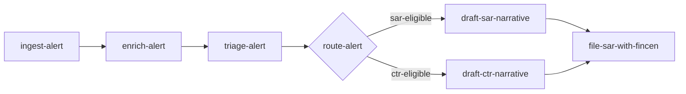

# IM-01 — Skill Architecture Patterns

## What this skill does

Coaches the engineer through decomposing a problem into a set of reusable, testable, composable AI skills. The output is a Skill Graph — a written list of skill candidates and a Mermaid dependency diagram — that becomes the spine for every later framework in the Innorve Method.

## When to invoke it

- A working prototype exists as a single script, notebook, or prompt and the team wants to "productionize" it.
- A new system is being designed and there is no agreed unit of decomposition yet.
- Multiple engineers are about to add features in parallel and you want to prevent overlap.
- The user asks "what should be a skill versus what should be a tool?"

## Where it sits in the Innorve Method

IM-01 is the foundation. Every later framework — contracts (IM-03), tenancy (IM-04), composition (IM-05), the capability graph (IM-06), the evidence binder (IM-07) — assumes you have named, bounded skills. If you skip IM-01 you will keep refactoring downstream artifacts every time the implicit decomposition shifts.

## Why this matters

The single most common reason AI systems stall is that the team cannot agree on what a "skill" is. Without that agreement, two engineers will build overlapping prompts, three teams will own the same logic, and the audit trail will be a tangle of one-off scripts. A Skill Graph forces the conversation early, when the cost of getting it wrong is a whiteboard, not a quarter.

## The coaching flow

Walk the user through these steps. Do not move on until each one has produced something written.

### 1. Establish the system's job

$ASK: *"In one sentence, what is the system supposed to do for the user or the business?"*

If the answer takes more than one sentence, push back. Two sentences usually means two systems. Force a single primary job. Secondary jobs go in a "deferred" list.

### 2. Name the inputs and outputs at the system boundary

$ASK: *"What goes in (events, requests, files, signals) and what comes out (decisions, documents, side effects)?"*

Capture both as bullet lists. These are the I/O contract of the system, not of any one skill. Later we will derive skill contracts from this.

### 3. Walk the data through

Have the user describe, in order, what happens to a single representative input from arrival to final output. Make them be specific. "The alert is enriched" is not enough — enriched with what, by what, written where.

### 4. Cut the walk-through into skills

A skill candidate emerges wherever one of these is true:

- The step has a different owner or oncall.
- The step has a different failure mode the system should recover from independently.
- The step is reusable across more than one walk-through.
- The step calls a different external system.
- The step produces an artifact someone other than the next skill might read.

If none of those are true, it is not a skill. It is a function.

$ASK: *"For each step, which of those five criteria applies? If none, fold it into its neighbor."*

### 5. Name each skill

Skills are named after what they produce, not what they do. Prefer `draft-sar-narrative` over `narrative-drafter`. Prefer `route-alert` over `alert-router`. The name is the contract preview — a teammate should guess the output from the name alone.

### 6. Sketch the dependency graph

Have the user draw the skills and their dependencies as a Mermaid diagram. Every edge is a real dependency: skill B cannot run until skill A produces its output. If two skills can run in parallel, do not draw a false edge.

### 7. Identify the seams

For every edge, ask: what is the artifact that crosses it? A SAR draft? A risk score? A redacted transcript? Write it on the edge. Edges without named artifacts are skills that were merged when they should have been split.

### 8. Pressure-test reusability

$ASK: *"For each skill, name a second system (real or hypothetical) where you would also use it. If you cannot, why is it a skill and not a function?"*

Some skills are intentionally single-use (the system's top-level orchestrator, for example). Most are not. If more than half your skills are single-use, your decomposition is too coarse — go back to step 4.

## The artifact produced

A **Skill Graph** with two parts.

### Part A — the skill candidate list

For each skill, capture:

```
- name: draft-sar-narrative
  produces: SAR Part III narrative (markdown, <= 4000 chars)
  consumes: enriched alert, customer KYC snapshot
  owner: financial-crimes-platform
  reuse: also used by CTR narrative drafting
  external: LLM (Claude), no other side effects
```

### Part B — the dependency diagram



Both parts go in the planning doc. The diagram is canonical — when prose and diagram disagree, fix the prose.

## Worked examples

### Example 1 — Regional credit union, SAR triage agent

The team starts with a 600-line notebook that turns an alert into a draft SAR. After IM-01:

- `ingest-alert` (consumes core-banking alert, produces normalized alert)
- `enrich-alert` (adds KYC snapshot, transaction history, prior cases)
- `triage-alert` (scores the alert, decides SAR/CTR/dismiss)
- `draft-sar-narrative` (LLM-backed)
- `assemble-sar-filing` (puts the FinCEN XML together)
- `file-sar-with-fincen` (the only step with an external side effect)

Six skills. The notebook had implicitly conflated drafting and assembly; the graph forces them apart. `enrich-alert` is reused later by the case-management UI, which is what makes it a skill rather than a helper.

### Example 2 — Regional health system, scheduling agent

The team has an Epic-connected agent that books specialist appointments. After IM-01:

- `parse-referral` (free text → structured referral)
- `verify-network-coverage` (against the patient's plan)
- `find-eligible-specialists` (Epic search + plan filter)
- `propose-slots` (offers three options)
- `confirm-booking` (writes back to Epic)

`verify-network-coverage` was a hidden conditional inside the original prompt. Pulling it out into its own skill is what later allows IM-07 to produce auditable evidence that the agent never recommended out-of-network care.

### Example 3 — SaaS billing startup, refund triage

Three engineers wrote three overlapping prompts. After IM-01:

- `classify-refund-request` (intent + reason code)
- `lookup-account-state` (subscription, MRR, history)
- `evaluate-refund-policy` (deterministic, not LLM — but still a skill, because it is reused by chargeback handling)
- `draft-customer-response` (LLM)
- `apply-refund` (Stripe-side effect, gated)

The graph reveals that `evaluate-refund-policy` was duplicated three times across the engineers' code. Naming it as a skill is the precondition for IM-02 (policy-as-code) to govern it.

## Common pitfalls

- **Naming skills as verbs in isolation.** `analyzer`, `processor`, `handler`. The name carries no information. Name skills after their output, then the contract writes itself in IM-03.
- **Treating LLM calls as the only skills.** Deterministic steps (policy evaluation, ID lookups, format conversion) are skills too if they meet the five criteria in step 4. If you only mark LLM calls, your graph will be governance-blind.
- **Drawing a false linear chain.** Most real systems have branches and joins. If your diagram is a straight line of six nodes, you have probably collapsed a router or hidden a parallel path.
- **Stopping at the first decomposition.** Walk steps 4 and 8 twice. The first cut is almost always too coarse on the LLM-heavy steps and too fine on the boring ones.
- **Letting reuse stay theoretical.** If a skill's "second use case" is hand-waved, it is not real reuse. Either find a real second consumer or accept the skill is single-use and revisit in IM-06.

## What this is NOT

- This skill does **not** write your skills' code. It produces the graph that tells you which code to write.
- This skill does **not** define skill contracts. That is IM-03's job, and it expects the Skill Graph as input.
- This skill does **not** decide which skills to ship first. Sequencing is a planning question, not an architecture question.
- This skill does **not** produce a Mermaid diagram for you. You draw it. Drawing it is what surfaces the missing edges.

## Next step

Run `innorve-skill-contract` (IM-03). For each skill in the graph, you will write a contract: inputs, outputs, failure modes, idempotency, and the side effects the runtime is allowed to take.

## Further reading

- The IM-01 chapter on the Innorve Method site: <https://innorve.academy/method#im-01>
- Parnas, "On the Criteria To Be Used in Decomposing Systems into Modules" (CACM, 1972) — the original argument that decomposition should follow change boundaries, not control flow. Still the right frame for skills.
- Anthropic, "Building effective agents" (2024) — for the distinction between workflows and agents that the graph makes visible.
